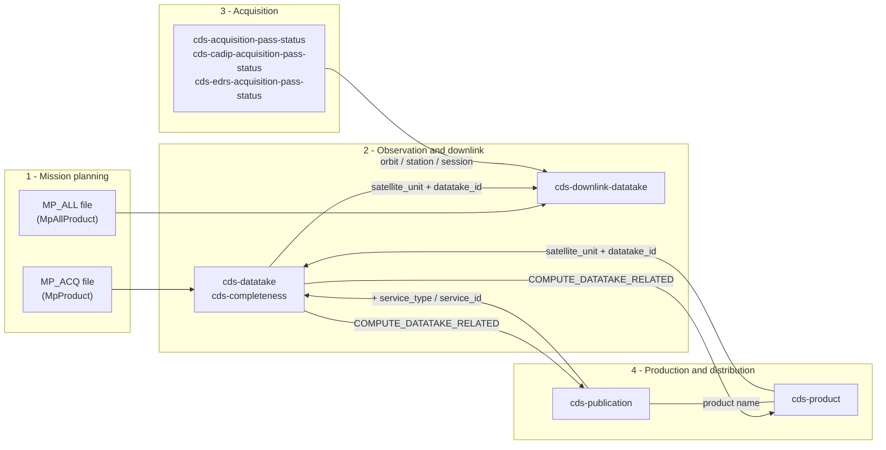
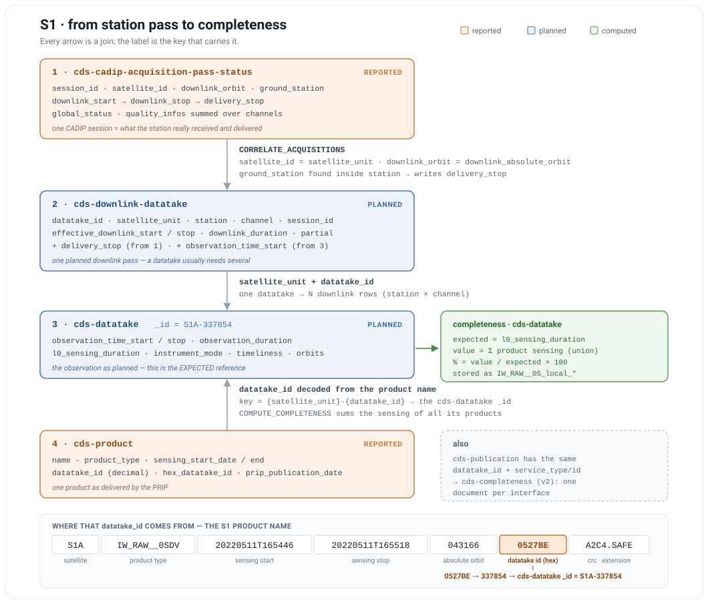
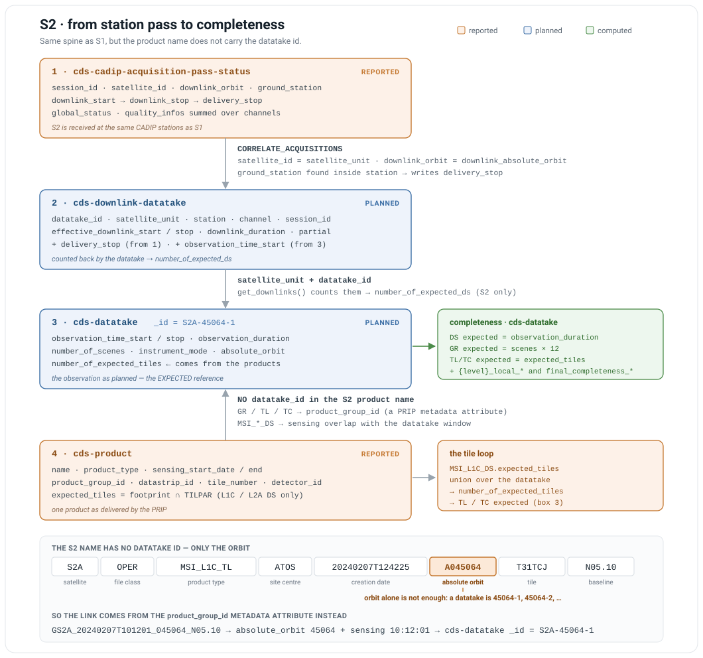
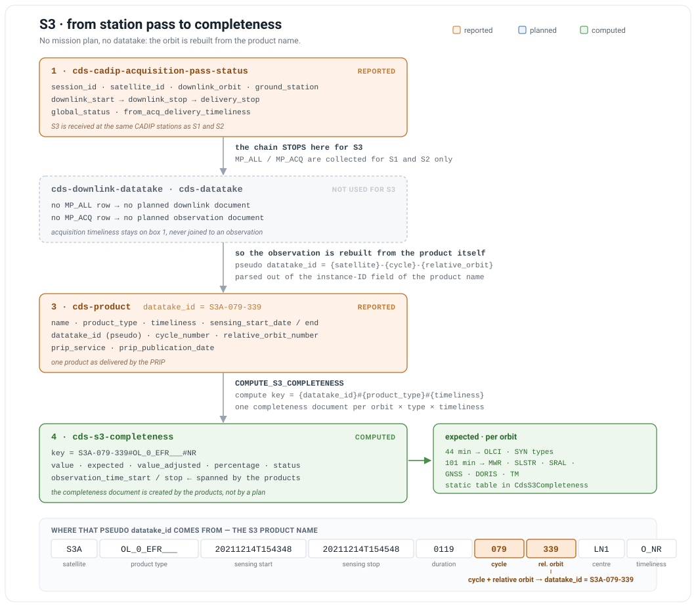
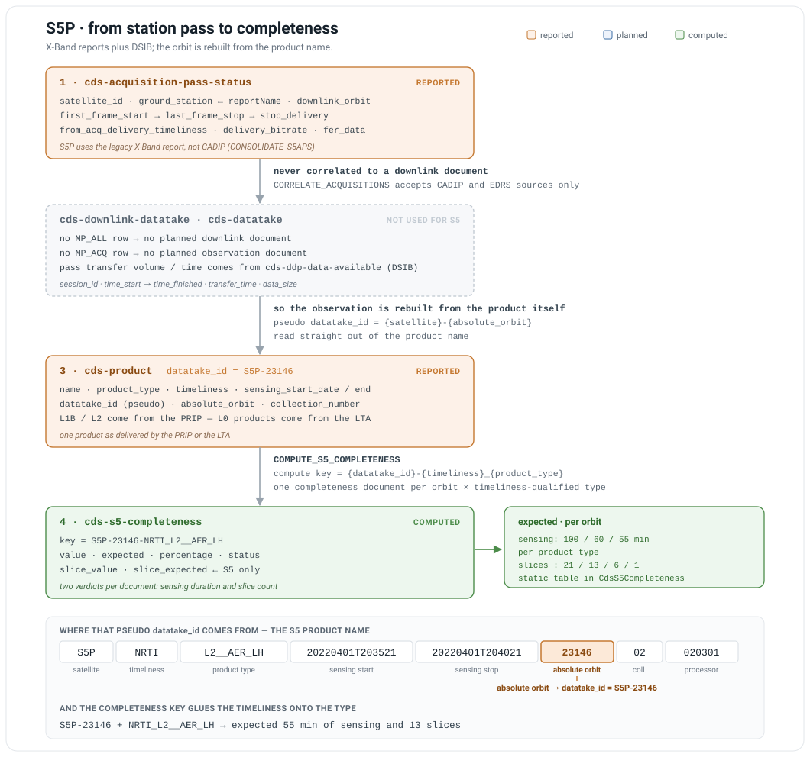
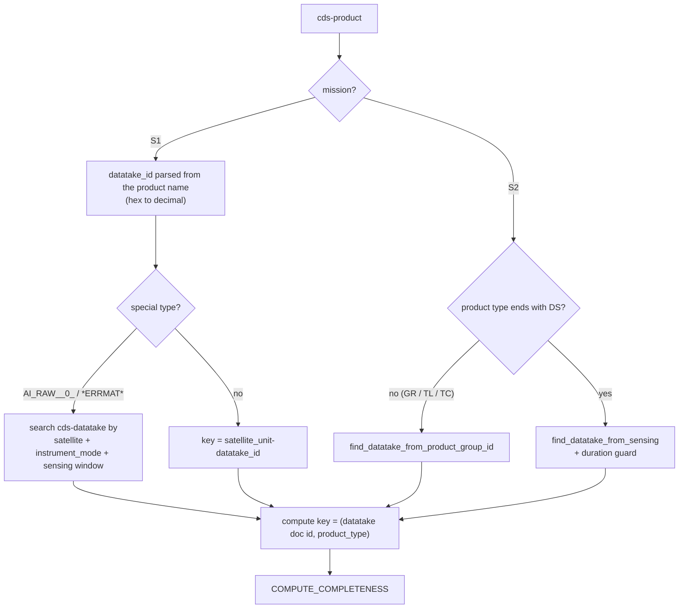

# Index correlation: from acquisition to dissemination

This document explains how the five core consolidated indexes relate to each other:

- `cds-downlink-datatake`
- `cds-acquisition-pass-status` (and its CADIP / EDRS variants)
- `cds-datatake` (and its v2 form `cds-completeness`)
- `cds-product`
- `cds-publication`

It follows the physical chain of a Sentinel observation — **plan → observe → downlink → acquire → produce → archive/disseminate** — and shows, at each step, which index is written, which fields carry the join, and how **completeness** and **timeliness** are derived from those joins.

Companion documents:

- [Model.md](Model.md) — index list, partitioning and Grafana time fields
- [Tolerance.md](Tolerance.md) — completeness tolerance configuration
- [README.md](README.md) — MaaS component architecture
- [OMCS_Technical_Dashboard_Description_For_Operation.md](OMCS_Technical_Dashboard_Description_For_Operation.md) — dashboard-by-dashboard description

Scope note: this document describes the **S1 / S2** chain, where the datatake is the pivot entity. S3 and S5 have no datatake concept in the dashboard; their equivalents (`cds-s3-completeness`, `cds-s5-completeness`, `cds-completeness-splitted`) are covered in [§6.6 S3 and S5: the splitted variant](#66-s3-and-s5-the-splitted-variant).

---

## 1. The five indexes at a glance

| Index | One document is… | Written by (ENGINE_ID) | Raw source | Document `_id` | Partition field |
| --- | --- | --- | --- | --- | --- |
| `cds-datatake` | one **planned observation** (a datatake) | `CONSOLIDATE_MP_FILE` (`MpProduct` → `CdsDatatake`) | `*MP_ACQ__L0_*.csv` (S1), `*S2*_MP_ACQ__MTL_*.csv` (S2) | `{satellite_unit}-{datatake_id}` | `observation_time_start` |
| `cds-completeness` | same datatake, but **one document per distribution service** | `CONSOLIDATE_MP_FILE` (`MpProduct` → `CdsCompleteness`) | idem | `{satellite_unit}-{datatake_id}` | `{mission}-{satellite_unit}-{service_type}-{service_id}` |
| `cds-downlink-datatake` | one **planned downlink** of one datatake, on one station and one channel | `CONSOLIDATE_MP_FILE` (`MpAllProduct` → `CdsDownlinkDatatake`) | `*MP_ALL__*.csv` | md5 of `satellite_id, mission, datatake_id, effective_downlink_start, station, channel, reportName` | `effective_downlink_start` |
| `cds-acquisition-pass-status` | one **X-Band acquisition pass** as reported by the station | `CONSOLIDATE_APS` | `raw-data-aps-product` | raw document id | `planned_data_start` |
| `cds-cadip-acquisition-pass-status` | one **CADIP session** (all channels aggregated) | `CONSOLIDATE_APS_SESSION` | `raw-data-aps-session` | `session_id` | `publication_date` |
| `cds-edrs-acquisition-pass-status` | one **EDRS link session** | `CONSOLIDATE_APS_EDRS` | `raw-data-aps-edrs` | raw document id | `planned_link_session_start` |
| `cds-product` | one **product**, all interfaces merged into a single document | `CONSOLIDATE_PRODUCT`, `CONSOLIDATE_DD_PRODUCT`, `CONSOLIDATE_LTA_PRODUCT` | PRIP, LTA, DD, AUXIP, MPCIP | md5 of the product name **without extension** | `sensing_start_date` (`%Y-%m`) |
| `cds-publication` | one **product on one interface** — strictly 1:1 with the raw document | `CONSOLIDATE_PUBLICATION` | same raw sources | the raw document id (e.g. md5 of `product_id` + `interface_name` for PRIP) | `sensing_start_date` (`%Y-%m`) |

Two granularity rules drive everything else:

- **`cds-product` is product-centric, `cds-publication` is event-centric.** One product published on PRIP, two LTAs and one DD yields **1** `cds-product` document and **4** `cds-publication` documents.
- **`cds-datatake` is plan-centric.** It exists as soon as the mission plan is collected, i.e. *before* any product exists — that is precisely what makes it usable as the "expected" reference.

> Partitioning subtlety: products and publications whose `product_level` is not one of `L0_`, `L1_`, `L2_`, `A` (auxiliary data, reports…) are partitioned on a **publication date** instead of on sensing, because sensing is meaningless for them. See `DynamicPartitionMixin` in [dynamic_partition_mixin.py](../modules/maas-cds/src/maas_cds/model/dynamic_partition_mixin.py).

---

## 2. The chain, end to end



### Stage 1 — Planning

The mission plan is the single source of "what should have happened".

- `MP_ACQ` rows become **`cds-datatake`** documents: `observation_time_start/stop`, `observation_duration`, `l0_sensing_duration` (S1 only), `number_of_scenes` (S2 only), `absolute_orbit`, `relative_orbit`, `instrument_mode`, `instrument_swath`, `polarization`, `timeliness`.
  See `consolidate_CdsDatatake_from_MpProduct` in [consolidate_mp_file.py:471](../modules/maas-cds/src/maas_cds/engines/reports/consolidate_mp_file.py#L471).
- The same rows also become **`cds-completeness`** documents, one per applicable `(service_type, service_id)` found in the `MaasConfigCompleteness` configuration — this is the "v2" completeness (see §6.5).
  See `consolidate_CdsCompleteness_from_MpProduct` in [consolidate_mp_file.py:562](../modules/maas-cds/src/maas_cds/engines/reports/consolidate_mp_file.py#L562).
- `MP_ALL` rows become **`cds-downlink-datatake`** documents: `effective_downlink_start/stop`, `acquisition_start/stop`, `downlink_duration`, `latency`, `station`, `channel`, `downlink_absolute_orbit`, `acquisition_absolute_orbit`, `partial`, `session_id`.
  See `consolidate_CdsDownlinkDatatake_from_MpAllProduct` in [consolidate_mp_file.py:678](../modules/maas-cds/src/maas_cds/engines/reports/consolidate_mp_file.py#L678).

One datatake can be downlinked over **several passes, stations and channels**, so the relation `cds-datatake` → `cds-downlink-datatake` is **1:N**. A downlink whose `partial` flag is set carries only part of the datatake.

### Stage 2 — Acquisition

Station and relay reports are consolidated per acquisition technology, into three separate indexes with three different keys:

| Index | Technology | Session/pass identity | Downlink window | Delivery window | Status field |
| --- | --- | --- | --- | --- | --- |
| `cds-acquisition-pass-status` | X-Band (legacy reports) | `satellite_id` + `ground_station` + `downlink_orbit` | `first_frame_start` → `last_frame_stop` | `start_delivery` → `stop_delivery` | `antenna_status`, `front_end_status`, `delivery_push_status` |
| `cds-cadip-acquisition-pass-status` | CADIP | `session_id` (+ `retransfer`) | `downlink_start` → `downlink_stop` | `delivery_start` → `delivery_stop` | `global_status` (`OK` / `NOK` / `INCOMPLETE`) |
| `cds-edrs-acquisition-pass-status` | EDRS (optical relay) | `link_session_id`, `geo_satellite_id` | `planned_link_session_start/stop` | `dissemination_start` → `dissemination_stop` | `total_status` |

CADIP aggregates per-channel `quality_infos` into session-level counters (`AcquiredTFs`, `ErrorTFs`, `CorrectedTFs`, `TotalVolume`, …), takes the **earliest** `DeliveryStart` and the **latest** `DeliveryStop` of all channels, and derives `fer_data = UncorrectableTFs / AcquiredTFs`.
See `aggregate_quality_infos_metrics` in [acquisition_pass_status.py:217](../modules/maas-cds/src/maas_cds/engines/reports/acquisition_pass_status.py#L217).

### Stage 3 — Production

A product produced by a PRIP is collected and consolidated **twice, into two different indexes**, from the same raw document:

- into `cds-publication` — "this product appeared on PRIP_S1C_Werum at 12:31:07";
- into `cds-product` — "this product exists; it is present on PRIP_S1C_Werum since 12:31:07".

Both engines share `fill_common_attributes` ([base.py:98](../modules/maas-cds/src/maas_cds/engines/reports/base.py#L98)), which parses the **product name** to obtain `mission`, `satellite_unit`, `product_type`, `product_level`, `datatake_id`, `absolute_orbit`, sensing dates, `polarization`, `tile_number`, `detector_id`… For S1 the datatake id embedded in the name is hexadecimal and is converted to decimal at that point; `hex_datatake_id` keeps the original form.

### Stage 4 — Archiving and dissemination

Later publications of the *same* product on LTA, DD or AUXIP add:

- a **new** `cds-publication` document (one per interface, per product);
- **more fields on the existing** `cds-product` document — `{interface_name}_is_published`, `{interface_name}_publication_date`, `{interface_name}_id`, `{interface_name}_content_length`, plus a `nb_{service}_served` counter (`nb_lta_served`, `nb_dd_served`, …).
  See `consolidate_service_information` in [product.py:272](../modules/maas-cds/src/maas_cds/engines/reports/product.py#L272).

That asymmetry is the reason both indexes exist: `cds-product` answers *"where is this product now?"* in one query, `cds-publication` answers *"what happened on this interface during this period?"*.

---

## 3. The correlation keys

### 3.1 The chain in one picture, per mission

The same four questions are answered by every mission — *what did the station receive, which observation was it, what was expected, what arrived* — but only S1 and S2 have a mission plan to compare against, and each mission finds its observation differently.

| Mission | Acquisition index | Planned downlink | Planned observation | How a product finds its observation |
| --- | --- | --- | --- | --- |
| **S1** | `cds-cadip-acquisition-pass-status` | `cds-downlink-datatake` | `cds-datatake` | `datatake_id` **in the product name**, hex → decimal |
| **S2** | `cds-cadip-acquisition-pass-status` | `cds-downlink-datatake` | `cds-datatake` | `product_group_id` **metadata**, or sensing overlap for datastrips |
| **S3** | `cds-cadip-acquisition-pass-status` | — none — | — none — | pseudo `datatake_id` = `{sat}-{cycle}-{relative_orbit}` from the name |
| **S5P** | `cds-acquisition-pass-status` (X-Band) + `cds-ddp-data-available` | — none — | — none — | pseudo `datatake_id` = `{sat}-{absolute_orbit}` from the name |

**S1** — the reference case: the datatake id travels inside the product name.



**S2** — same spine, but the name carries only the orbit, so the link comes from the `product_group_id` metadata attribute. Two expected values also flow *backwards* from the products: `number_of_expected_tiles` (from the L1C datastrip footprints) and `number_of_expected_ds` (a count of downlink rows).



**S3** — no mission plan at all: the middle of the chain is missing and the orbit is rebuilt from the cycle and relative orbit in the product name. Expected is a static 44 or 101 minutes per orbit.



**S5P** — like S3, plus two more differences: the pass is reported on the legacy X-Band index (never correlated to any downlink), and the completeness document carries a **second** verdict on the slice count.



### 3.2 The reference table

Every arrow below is implemented by a named engine, so a missing correlation can always be traced back to a queue that did not fire.

| # | From | To | Join keys | Who writes the link | Code |
| --- | --- | --- | --- | --- | --- |
| 1 | `cds-datatake` | `cds-downlink-datatake` | `datatake_id` **and** `satellite_unit` | `CORRELATE_ACQUISITIONS` with `source_type=CdsDatatake` — copies `observation_time_start` onto the downlink | [correlate_acquisitions.py:203](../modules/maas-cds/src/maas_cds/engines/compute/correlate_acquisitions.py#L203) |
| 2 | `cds-downlink-datatake` | `cds-datatake` (S2) | `datatake_id` + `satellite_unit`, counted | `CdsDatatakeS2.get_downlinks()` → dynamic field `number_of_expected_ds` | [datatake_s2.py:156](../modules/maas-cds/src/maas_cds/model/datatake_s2.py#L156) |
| 3 | `cds-cadip-acquisition-pass-status` | `cds-downlink-datatake` | `satellite_id` = `satellite_unit`, `downlink_orbit` = `downlink_absolute_orbit`, `ground_station` matched as a regexp against `station` | `CORRELATE_ACQUISITIONS` — copies `delivery_stop` | [correlate_acquisitions.py:88](../modules/maas-cds/src/maas_cds/engines/compute/correlate_acquisitions.py#L88) |
| 4 | `cds-edrs-acquisition-pass-status` | `cds-downlink-datatake` | `satellite_id` = `satellite_unit`, `geo_satellite_id` = `station`, and the downlink window inside `[dissemination_start − 30 min, dissemination_stop + 30 min]` | `CORRELATE_ACQUISITIONS` — copies `dissemination_stop` into `delivery_stop` | [correlate_acquisitions.py:60](../modules/maas-cds/src/maas_cds/engines/compute/correlate_acquisitions.py#L60) |
| 5 | `cds-product` | `cds-datatake` | `satellite_unit` + `datatake_id` → datatake `_id` = `{satellite_unit}-{datatake_id}` | product-side resolution, see §5 | [product_s1.py:20](../modules/maas-cds/src/maas_cds/model/product_s1.py#L20), [product_s2.py:43](../modules/maas-cds/src/maas_cds/model/product_s2.py#L43) |
| 6 | `cds-datatake` | `cds-product` / `cds-publication` | `get_related_documents_query()`: `satellite_unit` + `datatake_id` + sensing window ±1 h | `COMPUTE_DATATAKE_RELATED` — pushes `datatake_id`, `timeliness`, `absolute_orbit`, `relative_orbit`, `instrument_mode` down | [compute_datatake_related.py](../modules/maas-cds/src/maas_cds/engines/compute/compute_datatake_related.py) |
| 7 | `cds-publication` | `cds-product` | the product **name** (`cds-product._id` = md5 of the name without extension) | implicit — both are consolidated from the same raw document | [product.py:67](../modules/maas-cds/src/maas_cds/engines/reports/product.py#L67) |
| 8 | `cds-publication` | `cds-completeness` | `satellite_unit` + `datatake_id` + `service_type` + `service_id` | `CdsPublication.completeness_key` → index `cds-completeness-{mission}-{satellite_unit}-{service_type}-{service_id}`, doc `_id` `{satellite_unit}-{datatake_id}` | [publication.py:87](../modules/maas-cds/src/maas_cds/model/publication.py#L87) |
| 9 | `cds-product` (S2 `MSI_L1C_DS` / `MSI_L2A_DS`) | `cds-datatake` (S2) | `expected_tiles` computed from the product footprint ∩ TILPAR grid, unioned over the datatake | `CdsDatatakeS2.search_expected_tiles()` → `number_of_expected_tiles` | [datatake_s2.py:414](../modules/maas-cds/src/maas_cds/model/datatake_s2.py#L414) |
| 10 | `cds-cadip…` / `cds-edrs…` | `cds-hktm-acquisition-completeness` | CADIP: `session_id` ±5 s **and** `absolute_orbit`; EDRS: `link_session_id` | `search_acquistion_completeness_document()` | [acquisition_pass_status.py:54](../modules/maas-cds/src/maas_cds/model/acquisition_pass_status.py#L54) |

### 3.3 Notes on the fragile joins

**Acquisition → downlink is a heuristic join, not a key join.** `cds-downlink-datatake` does carry a `session_id` (taken from `MP_ALL`, with the `DCS_0X_` prefix stripped), and CADIP is keyed on `session_id` too — but the engine deliberately joins on `satellite_unit` + `downlink_absolute_orbit` + a substring match on `station`, because the station naming and the session identifiers do not match exactly between the plan and the reports. For EDRS the join is purely `satellite + geo satellite + a ±30 min time window`. Consequences:

- an unplanned or replanned pass will not correlate;
- a station renamed between plan and report will not correlate;
- `delivery_stop` is written as the **maximum** over all matching acquisitions, so a retransfer legitimately pushes it later.

**CADIP `session_id` is not byte-identical between interfaces.** `CdsCadipAcquisitionPassStatus.search_acquistion_completeness_document` rebuilds a `±5 s` range on the timestamp embedded in the session id (characters 4–18) before matching the HKTM completeness document.

**One S2 product → one datatake is also a heuristic.** S1 products carry the datatake id in their name; S2 products do not. They are attached either by `product_group_id` (GR / TL / TC) or, for datastrips, by sensing overlap with a tolerance and a duration guard. When several datatakes match, a warning is logged and `nb_datatake_document_that_match` is stored on the product — a useful field when investigating a wrong attachment. See [product_s2.py:43](../modules/maas-cds/src/maas_cds/model/product_s2.py#L43).

**`update.ds-products` is not bound in this repository's configuration.** `CORRELATE_ACQUISITIONS` also supports `source_type=CdsProductS2`, which walks back from an S2 L0 datastrip to the nearest downlink (`acquisition_start` within ±2 min of the product `sensing_start_date`) and fills `ds_product_name`, `ds_sensing_start_date`, `expected_tiles` and `from_ds_sensing_to_downlink_stop_timeliness` on `cds-downlink-datatake`. The `ProductConsolidatorEngine` emits the `update.ds-products` routing key for it, but no queue in `configuration/` binds that key — so those four fields are only populated where the deployment adds the binding.

---

## 4. Where the acquisition status is referenced

The acquisition indexes are read by **four** consumers. Only one of them uses the acquisition *dates*; the other three read the acquisition **status field**, and each one reads it differently.

| Consumer | Reads | Writes | Status used? |
| --- | --- | --- | --- |
| `CORRELATE_ACQUISITIONS` | `delivery_stop` / `dissemination_stop` | `cds-downlink-datatake.delivery_stop` and its timeliness | **No** — the correlation is done regardless of success or failure |
| `CONSOLIDATE_MP_FILE` (HKTM) / `CONSOLIDATE_HKTM` | the status + the session identity | `cds-hktm-acquisition-completeness.cadip_completeness` / `.edrs_completeness` | **Yes** — the pass must be successful to count |
| `COMPUTE_HKTM_RELATED` | `get_status()` | `cds-hktm-acquisition-completeness.related_document_id`, `.related_cadip_acquisition_id` | **Yes** — non-`OK` passes are skipped entirely |
| `AnomalyImpactMixinEngine` / `CORRELATE_ANOMALY_TICKET` | the pass identity | `cams_tickets[]`, `last_attached_ticket` on the acquisition itself | **No** — but the *anomaly* is what explains a bad status |

### 4.1 HKTM acquisition completeness — the one place the status decides a figure

`cds-hktm-acquisition-completeness` is built from the HKTM mission plan (`MP_HKTM` files), and for each planned HKTM pass it asks *"did the corresponding acquisition actually succeed?"* by querying the acquisition index:

| Technology | Session match | Status filter | Result field |
| --- | --- | --- | --- |
| CADIP | `session_id` = the plan's `session_id` with the `DCS_0X_` prefix stripped | `global_status == "OK"` | `cadip_completeness` = 1 if exactly **1** match, else 0 |
| CADIP (fallback) | `delivery_start` within ± `TOLERANCE_IN_MINUTES` of the timestamp embedded in `session_id[4:18]`, then filtered on the orbit `session_id[18:]` | same | `cadip_completeness` = 1 if **≥ 1** match |
| EDRS | `link_session_id` = the plan's `session_id` | `total_status != "NOK"` — **every non-NOK row counts as OK** | `edrs_completeness` = 1 if **≥ 1** match |

See `consolidate_CdsHktmAcquisitionCompleteness_from_MpHktmAcquisitionProduct` in [consolidate_mp_file.py:767](../modules/maas-cds/src/maas_cds/engines/reports/consolidate_mp_file.py#L767) and `count_hktm_acquisition_completeness` in [consolidate_mp_file.py:1044](../modules/maas-cds/src/maas_cds/engines/reports/consolidate_mp_file.py#L1044); the same logic exists in `CONSOLIDATE_HKTM` ([consolidate_hktm.py:203](../modules/maas-cds/src/maas_cds/engines/reports/consolidate_hktm.py#L203)).

Three asymmetries worth remembering when reading these figures:

- **CADIP requires exactly one match, EDRS accepts any.** A CADIP session duplicated by a retransfer therefore yields `cadip_completeness = 0` on the exact-session query, and only the date fallback recovers it.
- **The two statuses are not comparable.** CADIP's `global_status` is a positive test (`OK`), EDRS's `total_status` is a negative one (anything but `NOK`) — an EDRS row with an empty or unexpected status counts as a success.
- **The technology is inferred from the session id shape**, not from a field: `DCS_0X_…` → CADIP, `L…` → EDRS, anything else logs a warning and yields neither figure.

### 4.2 The reverse direction: an acquisition arriving late

`COMPUTE_HKTM_RELATED` handles the opposite ordering — the HKTM completeness document already exists and the acquisition report arrives afterwards. It calls `get_status()` on the acquisition (`global_status` for CADIP, `total_status` for EDRS — see [acquisition_pass_status.py:51](../modules/maas-cds/src/maas_cds/model/acquisition_pass_status.py#L51)) and **only continues when it equals `"OK"`**, then locates the HKTM completeness document via `search_acquistion_completeness_document()` (join #10) and stamps `related_document_id` / `related_cadip_acquisition_id` on it.

Consequence: a failed pass never gets linked back to its HKTM completeness document — the code carries an explicit `To improve` comment about it at [compute_hktm_related.py:212](../modules/maas-cds/src/maas_cds/engines/compute/compute_hktm_related.py#L212). Note also that for EDRS `get_status()` returns the raw `total_status`, so the `!= "NOK"` tolerance of §4.1 does **not** apply here: only a literal `"OK"` passes.

### 4.3 Anomaly correlation — the pass identity key

Acquisitions are attached to CAMS tickets through a **synthetic pass key** rather than a document id, matched against `cds-anomaly-correlation.impacted_passes`:

| Technology | Pass key |
| --- | --- |
| X-Band (legacy) | `{satellite_id}_X-Band_{downlink_orbit}_{ground_station}` — for S5 the station is taken from `reportName.split("_")[0]`, as the field is absent |
| CADIP | `{satellite_id}_X-Band_{downlink_orbit}_{ground_station}` — **also tagged `X-Band`**, so CADIP and legacy passes share one key namespace |
| EDRS | `{satellite_id}_EDRS_{link_session_id}_{ground_station}` |
| HKTM completeness | same two forms, chosen on whether `production_service_name` contains `EDRS` |

See `_populate_by_CdsAcquisitionPassStatus` and its siblings in [anomaly_impact.py:196](../modules/maas-cds/src/maas_cds/engines/reports/anomaly_impact.py#L196).

`CORRELATE_ANOMALY_TICKET` walks the same relation backwards, from a ticket to everything it impacts. Its `ACQUISITION_QUERY_DICT` ([anomaly_correlation_ticket.py:64](../modules/maas-cds/src/maas_cds/engines/compute/anomaly_correlation_ticket.py#L64)) searches **five** indexes per pass, with slightly different station fields each time:

- `X-Band` → `cds-acquisition-pass-status` (`ground_station`), `cds-cadip-acquisition-pass-status` (`station_id` = `{station}_`), `cds-hktm-acquisition-completeness`, `cds-hktm-production-completeness`
- `EDRS` → `cds-edrs-acquisition-pass-status`, `cds-hktm-acquisition-completeness`, `cds-hktm-production-completeness` (matched with a `station` prefix of `EDRS`, because the plan names the relay `EDRS-A` while the report names the receptor, e.g. `HDGS`)

### 4.4 The gap: legacy X-Band has no downlink correlation

`CORRELATE_ACQUISITIONS` only accepts `CdsCadipAcquisitionPassStatus` and `CdsEdrsAcquisitionPassStatus` as `source_type`. **`cds-acquisition-pass-status` (legacy X-Band, used for S5 and for historical S1/S2/S3 reports) is never correlated to `cds-downlink-datatake`.** Its `stop_delivery` therefore never reaches a downlink document, and `from_sensing_to_delivery_stop_timeliness` stays empty for those passes. X-Band acquisition timeliness is only available on the acquisition document itself (`from_acq_delivery_timeliness`), never joined to the observation.

For S5, the pass-level transfer information comes instead from `cds-ddp-data-available` (DSIB reports), which is why the "Acquisition Timeliness" dashboard uses a different downlink-orbit variable for S5 than for S1/S2/S3.

---

## 5. How a product finds its datatake

This is the single most important join of the whole chain: without it there is no completeness.



The result is a **compute key** `(datatake_id, product_type)`. `ComputeCompletenessEngine` deduplicates those keys across the whole message so a batch of 500 products of the same datatake triggers one computation per product type, not 500.

Products that cannot be attached keep `datatake_id = "MISSING"` (`utils.DATATAKE_ID_MISSING_VALUE`) and produce **no** compute key: they are invisible to completeness. S2 has a repair path — `CdsDatatakeS2.load_data_before_compute()` re-attaches orphan products found by `product_group_id` when the datatake itself is recomputed.

---

## 6. Completeness

### 6.1 The principle

> **Expected** comes from the plan (`cds-datatake`). **Value** comes from what was actually produced or published (`cds-product` / `cds-publication`). Completeness is the ratio, stored on the plan document.

All completeness fields therefore live on `cds-datatake` (or `cds-completeness`), never on the products. They follow a strict naming convention:

```
{key_field}_{scope}_value            raw measured value
{key_field}_{scope}_expected         value derived from the plan (+ tolerance)
{key_field}_{scope}_value_adjusted   min(value, expected)
{key_field}_{scope}_percentage       value_adjusted / expected * 100
{key_field}_{scope}_status           Missing | Partial | Complete | Unknown
```

Written by `set_completeness_attribut` in [datatake.py:779](../modules/maas-cds/src/maas_cds/model/datatake.py#L779).

Status thresholds ([status.py](../modules/maas-cds/src/maas_cds/lib/status.py)):

| Percentage | Status |
| --- | --- |
| 0 | `Missing` |
| 0 < p < 100 | `Partial` |
| ≥ 100 | `Complete` |
| no expected value available | `Unknown` (only `_value` is stored) |

Because `value_adjusted` is capped at `expected`, the percentage can never exceed 100 — over-production is visible only by comparing `_value` with `_expected`.

### 6.2 Scopes

`CompletenessScope` ([enumeration.py](../modules/maas-cds/src/maas_cds/model/enumeration.py)):

| Scope | `key_field` is… | Meaning |
| --- | --- | --- |
| `local` | a **product type** (`IW_RAW__0S`, `MSI_L1C_TL`, …) | completeness of one product type of one datatake |
| `global` | an **aggregation key** | all product types of the datatake summed into comparable units |
| `slice` | a product type | used only as a per-slice tolerance for S1 area-restricted types |
| `final` | — | S2 only: single figure for the whole datatake (see §6.4) |

The aggregation key is what makes the global sum legitimate — "we cannot mix carrots and potatoes":

- **S1** — `get_global_key_field` returns `sensing` for everything, except `etad` for `*ETA*` types and `errmat` for `*ERRMAT*`. So `sensing_global_*` sums the sensing durations of L0 + L1 + L2 types.
- **S2** — the key is the last two characters of the product type: `DS`, `GR`, `TL`, `TC`. So `DS_global_*`, `GR_global_*`, `TL_global_*`, `TC_global_*`.

### 6.3 What "value" actually measures

| Mission | Product type | Compute method | Unit |
| --- | --- | --- | --- |
| S1 | all sensing types | `compute_total_sensing_product` — **union** of the product sensing periods (overlaps counted once) | microseconds |
| S1 | `*ETA*`, `*ERRMAT*` | `len` — number of products | count |
| S2 | `*_DS` | `compute_total_sensing_product` | microseconds |
| S2 | `*_GR`, `*_TL`, `*_TC` | `len` | count |

Expected values:

| Mission | Product type | Expected |
| --- | --- | --- |
| S1 | nominal | `l0_sensing_duration` from the plan |
| S1 | `RF_RAW__0S` | hardcoded per satellite (2 800 000 µs for S1A/S1B, 2 690 000 µs for S1C/S1D) |
| S1 | `*OCN*`, `EW`/`SLC` | sensing of the L0 `RAW__0S` products whose footprint overlaps the EU mask above a per-type, date-dependent threshold |
| S1 | `*ETA*` | count of `SLC__1S` products of the datatake |
| S1 | `*ERRMAT*` | 1 |
| S2 | `L0_ DS` | `observation_duration` |
| S2 | `L1x / L2A DS` | `observation_duration − 2 × 3 608 000` µs (first and last scene are half scenes) |
| S2 | `L0_ GR` | `number_of_scenes × GR-per-scene` (12 for most instrument modes, 4 for `RAW`) |
| S2 | `L1x GR` | `(number_of_scenes − 2) × GR-per-scene` |
| S2 | `L1C / L2A TL`, `TC` | `number_of_expected_tiles` — **derived from the products themselves**, see below |

Two expected values are *not* purely planned, which makes them arrive late:

- **`number_of_expected_tiles`** (S2) is the size of the union of `expected_tiles` over the `MSI_L1C_DS` products of the datatake. `expected_tiles` itself is the intersection of the product footprint with the S2 TILPAR grid, computed at consolidation time. Until at least one L1C DS is published, TL/TC expected is 0 and their status is `Unknown`. This is why `impact_other_calculation` re-triggers the TL/TC computation whenever an `MSI_L1C_DS` arrives.
- **S1 area-restricted expected** (`OCN`, `EW` `SLC`) needs the L0 footprints, so the same re-trigger mechanism applies from `RAW__0S`.

Which products are counted is itself filtered: `find_brother_products_scan` keeps only products having a `prip_id`, whose `prip_service` is in the list returned by `get_service_for_completeness()` for that satellite and date, within the observation window ±1 h. In other words **v1 completeness measures production at the reference PRIP only** — not archiving, not dissemination.

### 6.4 Beyond the ratio: three extra indicators

**Tolerance.** Every expected value is adjusted by a configurable, regexp-matched tolerance before the ratio is computed (`completeness_tolerance` in the engine configuration). Units are per mission and per type — see [Tolerance.md](Tolerance.md). S2 additionally applies `STATIC_COMPLETENESS_VALUE` on the *measured* value of DS types.

**Missing periods.** For the reference L0 type only (`*RAW__0S` for S1, `MSI_L0__DS` for S2), gaps between consecutive products inside the observation window are materialized as a `missing_periods` array of `{name, product_type, sensing_start_date, sensing_end_date, duration}`. Requires `generate_missing_periods` and a `missing_periods_maximal_offset` in the engine configuration. See `compute_missing_production` in [datatake.py:239](../modules/maas-cds/src/maas_cds/model/datatake.py#L239).

**Duplicates and deletion follow-up.** Two consecutive products overlapping by more than 30 % (and, for S2, more than 15 s) are a duplicated pair. The datatake stores per-type indicators (`{product_type}_duplicated_max_duration`, `_max_percentage`, and their `duplicated_global_*` maxima) plus a nested `duplicateds` object listing the pairs and, per interface (`DD` / `LTA`), how many pairs were expected to be cleaned up versus how many still survive — including `deletion_completenness_percentange`. Which interfaces are expected for a product type is read from the `MaasConfigDataflow` configuration, so an LTA-only type is never reported as "not deleted from DD". See `finalize_duplicateds` in [datatake.py:530](../modules/maas-cds/src/maas_cds/model/datatake.py#L530).

**Completeness is computed twice per datatake.** `compute_completeness()` runs a first pass **including** products already flagged as deleted, captured into `original_completeness`, then a live pass **excluding** them, written on the document fields. Comparing the two tells whether a deletion degraded the completeness. Both passes share a single database query through `_brother_products_cache`. See [datatake.py:875](../modules/maas-cds/src/maas_cds/model/datatake.py#L875).

**S2 also has level and final completeness.** `compute_extra_completeness` normalizes each product type value into "DS-equivalent duration" (`value × DS_expected / type_expected`), sums it per level into `{L0_|L1A|L1B|L1C|L2A}_local_*`, and then into `final_completeness_{value,expected,percentage,status}` — the single S2 figure. See [datatake_s2.py:770](../modules/maas-cds/src/maas_cds/model/datatake_s2.py#L770).

### 6.5 Two generations: `cds-datatake` (v1) and `cds-completeness` (v2)

|  | v1 — `cds-datatake` | v2 — `cds-completeness` |
| --- | --- | --- |
| Engine | `COMPUTE_COMPLETENESS` | `COMPUTE_COMPLETENESS_V2` |
| Measures from | `cds-product` | `cds-publication` |
| Interface scope | the reference PRIP only, hardcoded per satellite and date in `get_service_for_completeness()` | **one document per `(service_type, service_id)`**, driven by `MaasConfigCompleteness` |
| Product types considered | all types expected for the instrument mode | intersected with what `MaasConfigDataflow` says that service distributes |
| Index layout | partitioned by `observation_time_start` | partitioned by `{mission}-{satellite_unit}-{service_type}-{service_id}` |
| Answers | "was the datatake produced?" | "was the datatake produced **and made available on this interface**?" |
| Triggered by | `new/update.cds-product-s1`, `-s2`, `new/update.cds-datatake-s1`, `-s2` | `new/update.cds-publication-s1`, `-s2`, `new/update.cds-completeness-s1`, `-s2` |

Both are fed from the same mission-plan rows, and v2 reuses the whole v1 computation machinery (`CdsCompleteness` inherits from `CdsDatatake`). v2 is what turns completeness from a *production* indicator into a *production + archiving + dissemination* indicator: the same datatake gets one completeness document per PRIP, per LTA and per DD.

The routing to the right v2 document is entirely contained in `CdsPublication.completeness_key`: index name from `(mission, satellite_unit, service_type, service_id)`, document id from `(satellite_unit, datatake_id)`, model class from `CdsCompleteness{mission}`.

### 6.6 S3 and S5: the splitted variant

S3 and S5 have no datatake. Their completeness document is keyed on `(datatake_id, timeliness, product_type)` — see `CdsPublication.completeness_splitted_key` — and lives in `cds-completeness-splitted` (or the legacy `cds-s3-completeness` / `cds-s5-completeness`), driven by `COMPUTE_S3_COMPLETENESS` / `COMPUTE_S5_COMPLETENESS` and the `MaasConfigCompletenessS3` / `S5` configurations. The `timeliness` in the key is what makes an `NR` and an `NT` version of the same orbit two separate completeness documents.

### 6.7 Completeness that does not live on the datatake

Not every completeness question goes through the datatake:

| Question | Where the answer lives |
| --- | --- |
| Is this product on all the LTAs it should be on? | `cds-product.nb_lta_served` vs `expected_lta_number` |
| Is this product on the DDs? | `cds-product.nb_dd_served`, `{interface}_is_published` |
| Was the whole datatake downlinked? | `cds-downlink-datatake` rows, `partial` flag; S2: `number_of_expected_ds` on the datatake |
| Was the HKTM of this pass acquired and produced? | `cds-hktm-acquisition-completeness`, `cds-hktm-production-completeness` |
| Did the acquisition itself succeed? | acquisition `global_status` / `total_status`, `fer_data`, `ErrorTFs` vs `AcquiredTFs` |
| Are we within the technical budget? | `cds-databudget` compared against product counts and volumes |

---

## 7. Timeliness

### 7.1 Two unrelated meanings of the word

This is a recurring source of confusion:

- **`timeliness` (keyword field)** on `cds-datatake`, `cds-product`, `cds-publication` is a **service class**, not a duration: `NRT-PT`, `NTC`, `NOMINAL`, `NR`, `NT`, `OPER`, `AUX`, `_`… For S1/S2 it comes from the mission plan and is propagated onto products and publications by `fill_from_datatake` / `COMPUTE_DATATAKE_RELATED`; for S3/S5 it is parsed from the product name. When unknown it is set to `"_"` rather than left null, so Grafana can display it. The mapping between these values and the technical-budget classes is tabulated in [OMCS_Technical_Dashboard_Description_For_Operation.md:1819](OMCS_Technical_Dashboard_Description_For_Operation.md#L1819).
- **`*_timeliness` (long fields)** are **measured durations, in microseconds**, computed by `get_microseconds_delta`. Note that this helper **swaps its arguments when start > end**, so these fields are always positive: a negative latency shows up as a positive one, never as a negative number.

### 7.2 Every measured timeliness, by stage

| Stage | Field | Index | Formula | Written by |
| --- | --- | --- | --- | --- |
| Acquisition (X-Band) | `from_acq_delivery_timeliness` | `cds-acquisition-pass-status` | `stop_delivery − first_frame_start` | `CONSOLIDATE_APS` |
| Acquisition (CADIP) | `from_acq_delivery_timeliness` | `cds-cadip-acquisition-pass-status` | `delivery_stop − downlink_start` | `CONSOLIDATE_APS_SESSION` |
| Acquisition throughput | `delivery_bitrate` | both above | `volume / (from_acq_delivery_timeliness / 10⁶)` — `overall_data_volume` for X-Band, `TotalVolume` for CADIP | same engines |
| Observation → delivery | `from_sensing_to_delivery_stop_timeliness` | `cds-downlink-datatake` | `delivery_stop − observation_time_start` | `CORRELATE_ACQUISITIONS` |
| Datastrip sensing → downlink | `from_ds_sensing_to_downlink_stop_timeliness` | `cds-downlink-datatake` | `delivery_stop − ds_sensing_start_date` | `CORRELATE_ACQUISITIONS` (S2, `update.ds-products` path) |
| Production | `from_sensing_timeliness` | `cds-publication` | `publication_date − sensing_end_date` | `CONSOLIDATE_PUBLICATION` |
| Transfer / circulation | `transfer_timeliness` | `cds-publication` | `publication_date − origin_date` | `CONSOLIDATE_PUBLICATION` |
| PRIP → DD dissemination | `from_prip_{dd}_timeliness` (`from_prip_dddas_timeliness`, `from_prip_ddip_timeliness`, `from_prip_ddcreodias_timeliness`) | `cds-product` | `{dd}_publication_date − prip_publication_date` | `CONSOLIDATE_PRODUCT` / `CONSOLIDATE_DD_PRODUCT` via `calculate_dd_timeliness` |
| Pass transfer (DSIB) | `transfer_time` | `cds-ddp-data-available` | from the DSIB report | `CONSOLIDATE_DDP_DATA_AVAILABLE` |

`from_sensing_timeliness` is written on **every** publication, so the same product has one production timeliness per interface — the PRIP one is the production latency, the DD one is the end-to-end sensing-to-dissemination latency. That is exactly what the "E2E Timeliness (Disseminated from Sensing)" dashboards plot.

### 7.3 Chaining the stages: the end-to-end budget

For one datatake, the pieces line up like this:

```
observation_time_start ──────────────────────────────────────────────► sensing_end_date
        │                                                                     │
        │ cds-datatake / cds-downlink-datatake                                │
        ▼                                                                     ▼
   effective_downlink_start ─► delivery_stop        prip_publication_date ─► {dd}_publication_date
        └──── from_sensing_to_delivery_stop_timeliness ────┘   └─ from_prip_{dd}_timeliness ─┘
                                                    └──── from_sensing_timeliness (PRIP) ────┘
                                        └───────── from_sensing_timeliness (DD publication) ──┘
```

Practical consequences:

- **Acquisition timeliness** and **production timeliness** are computed on different indexes, with different keys, and there is no single field joining them. To get a real end-to-end figure per datatake you join `cds-downlink-datatake` (on `satellite_unit` + `datatake_id`) with `cds-publication` (on `satellite_unit` + `datatake_id`) and take `max(delivery_stop)` versus `max(publication_date)`.
- `from_sensing_to_delivery_stop_timeliness` is only populated once **both** sides of the correlation arrived — the acquisition report brings `delivery_stop`, the datatake brings `observation_time_start`. Either message order works, because both branches of `CORRELATE_ACQUISITIONS` recompute the delta when they find the other field already present.
- `transfer_timeliness` relies on `origin_date`, which is **not consolidated for DD interfaces** (flagged as a FIXME in [publication.py:205](../modules/maas-cds/src/maas_cds/engines/reports/publication.py#L205)). Treat DD `transfer_timeliness` with suspicion.

### 7.4 Thresholds

Threshold values (10 min / 30 min for auxiliary data, per-type mission budgets, …) are **not stored in the consolidated indexes**. They are held in the Grafana dashboards and in `cds-databudget` / the technical-budget configuration, and applied at display time. The indexes store the measured durations; the dashboards decide what "late" means. The `cds-publication` mapping does reserve `within_from_sensing_timeliness` and `within_transfer_timeliness` fields for a stored verdict, but no engine in `maas-cds` currently writes them.

---

## 8. Worked example: one S1 datatake

| # | Event | Index written | Key fields |
| --- | --- | --- | --- |
| 1 | `S1A_MP_ACQ__L0__…csv` collected | `cds-datatake-2026-08` | `_id = S1A-337854`, `observation_time_start`, `l0_sensing_duration = 702 688 000`, `instrument_mode = IW`, `timeliness = NRT-PT` |
| 2 | same file, v2 | `cds-completeness-S1-S1A-PRIP-S1A_Serco` (and one per configured service) | `_id = S1A-337854` |
| 3 | `S1A_MP_ALL__…csv` collected | `cds-downlink-datatake` | 2 rows (2 stations), `datatake_id = 337854`, `effective_downlink_start`, `station`, `channel` |
| 4 | Step 1 triggers `CORRELATE_ACQUISITIONS` | `cds-downlink-datatake` | `observation_time_start` copied onto both rows |
| 5 | CADIP session report collected | `cds-cadip-acquisition-pass-status` | `_id = session_id`, `downlink_start`, `delivery_stop`, `from_acq_delivery_timeliness`, `global_status` |
| 6 | Step 5 triggers `CORRELATE_ACQUISITIONS` | `cds-downlink-datatake` | `delivery_stop` = max over matching acquisitions, `from_sensing_to_delivery_stop_timeliness` computed |
| 7 | PRIP publishes `S1A_IW_RAW__0SDV_…SAFE` | `cds-publication` + `cds-product` | publication: `_id = md5(product_id, PRIP_S1A_Serco)`, `from_sensing_timeliness`; product: `_id = md5(name)`, `prip_publication_date`, `datatake_id = 337854` |
| 8 | Step 7 triggers `COMPUTE_COMPLETENESS` | `cds-datatake` | `IW_RAW__0S_local_value/expected/percentage/status`, then `sensing_global_*` |
| 9 | Step 7 triggers `COMPUTE_COMPLETENESS_V2` | `cds-completeness-S1-S1A-PRIP-…` | same fields, but measured from publications of that service |
| 10 | LTA publishes the same product | `cds-publication` (new doc) + `cds-product` (updated) | `LTA_*_publication_date`, `nb_lta_served += 1` |
| 11 | DD publishes the same product | `cds-publication` (new doc) + `cds-product` (updated) | `dddas_publication_date`, `from_prip_dddas_timeliness` |
| 12 | Step 10/11 trigger `COMPUTE_COMPLETENESS_V2` | `cds-completeness-S1-S1A-LTA-…` / `-DD-…` | archiving and dissemination completeness of the datatake |

At the end, the question *"was datatake S1A-337854 fully observed, downlinked, produced, archived and disseminated on time?"* is answered by five documents sharing `datatake_id = 337854`, one per stage — which is precisely the design intent.

---

## 9. Operational checklist

When a completeness or timeliness figure looks wrong, walk the joins in order:

1. **Does the datatake exist?** No `cds-datatake` / `cds-completeness` document → the mission plan was not collected, or `timeliness = NOT_RECORDING` (test rows are dropped). Nothing downstream can work.
2. **Is `expected` non-zero?** A `_status` of `Unknown` with a non-zero `_value` means the plan is there but the expected could not be derived — for S2 TL/TC this usually means no `MSI_L1C_DS` product has arrived yet (`number_of_expected_tiles = 0`).
3. **Is the product attached?** Check `cds-product.datatake_id`. `MISSING` → no compute key → invisible to completeness. For S2, check `nb_datatake_document_that_match`.
4. **Is the product in the completeness perimeter?** v1 counts only products with a `prip_id` whose `prip_service` matches `get_service_for_completeness()` for that satellite and date. A new PRIP not added to that table silently produces 0 % completeness.
5. **Is the product type expected at all?** v2 intersects the instrument-mode expectation with `MaasConfigDataflow`; a type not declared for that service is not counted and not expected.
6. **Was something deleted?** Compare the live fields with `original_completeness`. A drop present in the live values but not in the original one is a deletion effect, and `duplicateds.deletions` says whether it was an intended duplicate cleanup.
7. **Did the acquisition correlate?** A `cds-downlink-datatake` row without `delivery_stop` means no acquisition matched — check the station naming and the downlink orbit, and remember EDRS matching uses a ±30 min window.
8. **Check the routing keys.** Every arrow in §3 is a queue. Consult `configuration/engine/aio/cds-engine-conf.json`: if a queue is not bound in the deployed profile, the corresponding field simply never gets written (the `update.ds-products` case in §3 is a live example).

---

## 10. Field reference

### `cds-downlink-datatake` — the downlink plan, enriched by reality

| Field | Origin |
| --- | --- |
| `datatake_id`, `satellite_unit`, `mission` | MP_ALL |
| `effective_downlink_start/stop`, `downlink_duration`, `latency` | MP_ALL |
| `acquisition_start/stop`, `acquisition_absolute_orbit`, `acquisition_relative_orbit` | MP_ALL |
| `downlink_absolute_orbit`, `downlink_polarization`, `channel`, `station`, `partial`, `session_id` | MP_ALL |
| `observation_time_start` | copied from `cds-datatake` |
| `delivery_stop` | copied from the acquisition (max) |
| `from_sensing_to_delivery_stop_timeliness` | computed |
| `ds_product_name`, `ds_sensing_start_date`, `expected_tiles`, `from_ds_sensing_to_downlink_stop_timeliness` | copied from an S2 L0 datastrip product (`update.ds-products` path) |

### `cds-datatake` — the plan and its verdict

| Group | Fields |
| --- | --- |
| Identity | `key`, `datatake_id`, `hex_datatake_id`, `satellite_unit`, `mission`, `name` (the MP report), `application_date` |
| Plan | `observation_time_start/stop`, `observation_duration`, `l0_sensing_time_start/stop`, `l0_sensing_duration`, `number_of_scenes`, `absolute_orbit`, `relative_orbit`, `instrument_mode`, `instrument_swath`, `polarization`, `timeliness` |
| Derived expected | `number_of_expected_tiles` (S2), `number_of_expected_ds` (S2, dynamic) |
| Completeness | `{product_type}_local_*`, `{sensing\|etad\|errmat\|DS\|GR\|TL\|TC}_global_*`, `{level}_local_*` and `final_completeness_*` (S2) |
| Quality | `missing_periods[]`, `duplicateds{items[], pairs_count, deletions[], datastrip_pairs[]}`, `duplicated_global_max_duration/percentage`, `original_completeness` |
| Anomaly | `cams_tickets[]`, `last_attached_ticket`, `last_attached_ticket_url`, `cams_origin`, `cams_description` |
| Links | `datastrip_ids[]`, `product_group_ids[]` (S2) |

### `cds-product` — one document per product, all interfaces

| Group | Fields |
| --- | --- |
| Identity | `key` (= `_id`), `name`, `mission`, `satellite_unit`, `product_type`, `product_level`, `product_class`, `product_granularity` |
| Sensing | `sensing_start_date`, `sensing_end_date`, `sensing_duration` |
| Datatake link | `datatake_id`, `hex_datatake_id`, `absolute_orbit`, `relative_orbit`, `instrument_mode`, `instrument_swath`, `polarization`, `timeliness` |
| S2 specifics | `datastrip_id`, `product_group_id`, `tile_number`, `detector_id`, `expected_tiles`, `cloud_cover` |
| S1 specifics | `EU_coverage_percentage` and the other `*_coverage_percentage` mask fields |
| Production | `prip_id`, `prip_service`, `prip_publication_date` |
| Per interface (dynamic) | `{interface_name}_is_published`, `{interface_name}_publication_date`, `{interface_name}_id`, `{interface_name}_content_length` |
| Counters | `nb_prip_served`, `nb_lta_served`, `nb_dd_served`, `nb_auxip_served`, `expected_lta_number` |
| Dissemination timeliness | `from_prip_dddas_timeliness`, `from_prip_ddip_timeliness`, `from_prip_ddcreodias_timeliness` |
| Deletion | `{interface}_{service}_is_deleted`, `_deletion_issue`, `_deletion_date`, `_deletion_cause`, `nb_dd_deleted`, `nb_lta_deleted` |

### `cds-publication` — one document per (product, interface)

| Group | Fields |
| --- | --- |
| Identity | `key`, `name`, `product_uuid`, `service_type`, `service_id` |
| Event | `publication_date`, `origin_date`, `modification_date`, `eviction_date`, `publication_count` |
| Timeliness | `from_sensing_timeliness`, `transfer_timeliness` (and the unused `within_*` / `*_time` variants) |
| Completeness routing | `datatake_id`, `satellite_unit`, `product_type`, `product_level`, `timeliness` (+ `service_type`, `service_id`) |
| Deletion | `deletion_issue`, `deletion_date`, `deletion_cause` |

### Acquisition indexes

See the comparison table in §2, stage 2. Shared with the rest of the model: `cams_tickets[]`, `last_attached_ticket`, `mission`, `updateTime`.
